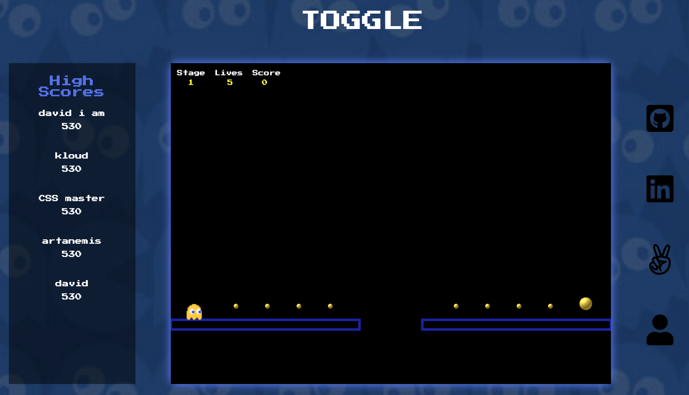
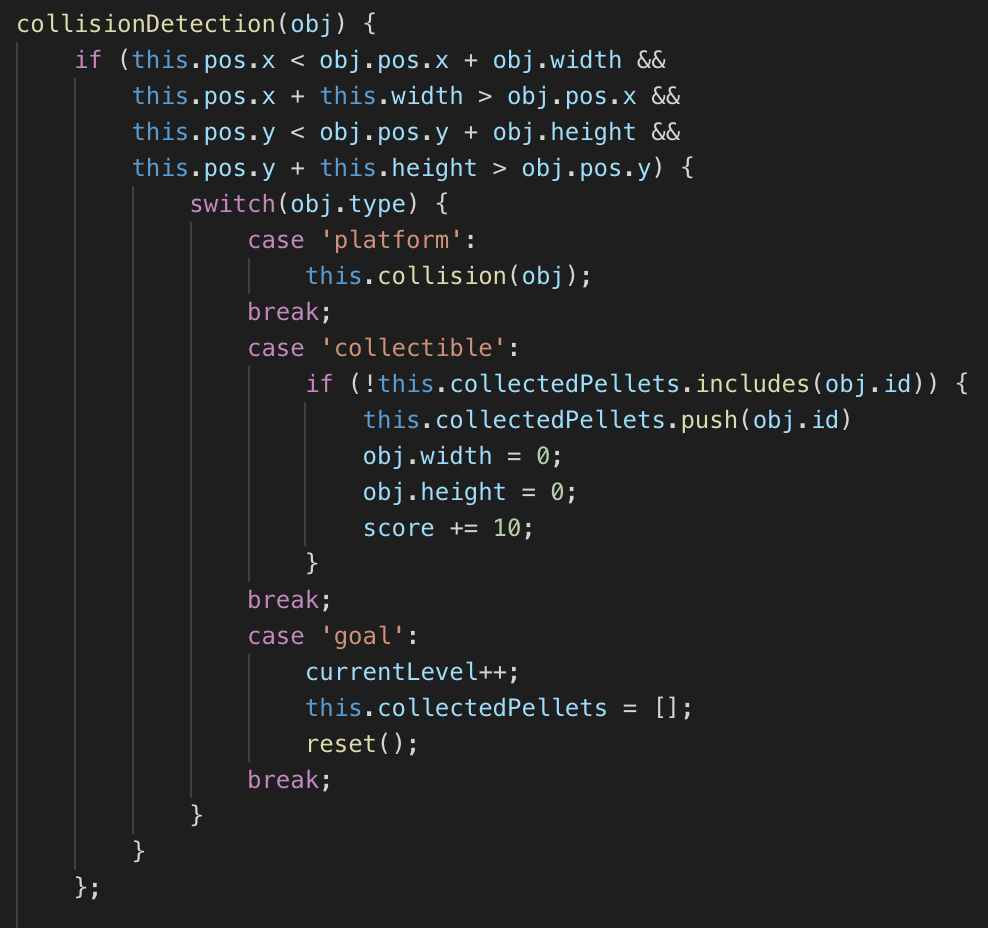
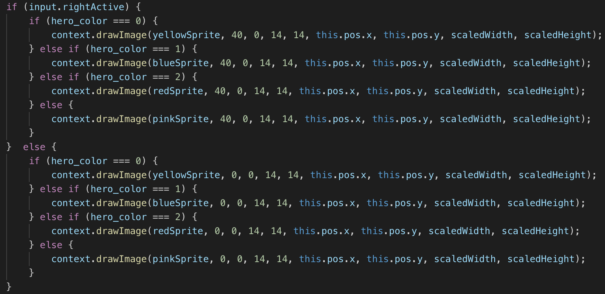

# Toggle
Toggle is a JavaScript platformer inspired by Pacman and OnOff!

You can play Toggle [here](https://davidyoon85.github.io/Toggle)! Or visit my portfolio site [here](https://davidyoon85.github.io)!

## Controls
* Press AWD or Spacebar to move.
* Press M to mute the music.
* Press Enter to toggle hero color.
* On the game won or game loss screen, click on canvas to restart game.

## Features
* Object collsion detection between player and objects.

* Player must reach the power pellet in order to go on to the next level.
* Collecting pellets along the way will increase your score.
* Player can toggle their hero color, to choose from: yellow, red, pink or blue.

* After game is won or lost, player can enter their name into the leaderboard.
* After name input, player name and score is sent to database, then leaderboard refreshes with current top 5 scores.

## Future Plans
I plan on implementing 3 new features to the game.
* First, I will create new levels.
* Second, players will need to collect all the pellets in order to get to the next level.
* Third, change score system to account for time instead of points.
